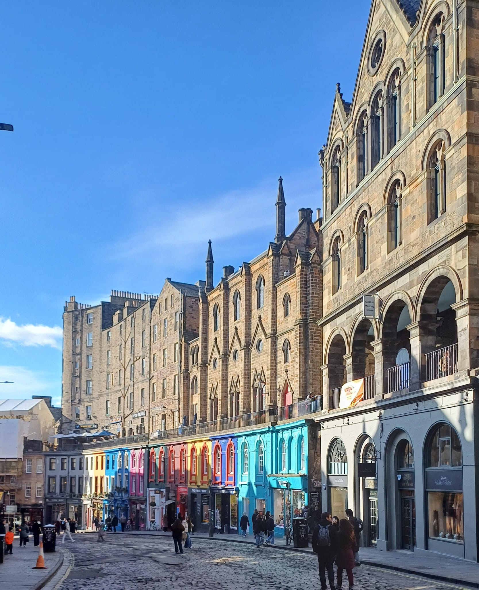

## Doesn't this feel so familiar already?

On our last vacation in Edinburgh, my wife turned to me mid-walk and said,
"Doesn't this feel so familiar already?"

She was right. We’d only been there three days, yet somehow, we knew where to find the best coffee, which side streets to cut through, and even when it was worth breaking the rules and jaywalking. It felt like we belonged.

But then I thought of my cousin in Leicester. He’s lived there for years, but if you asked him to walk you to the nearest park without GPS, he’d open Google Maps. Not because he’s lazy—he just doesn’t seem to build that “mental map” of places the way some people do.

Over time, I’ve learned there’s a difference between two types of navigation knowledge[^1]:

* Route knowledge – knowing how to get somewhere step-by-step. (“Turn left at the bakery, then right at the bus stop.”)
* Survey knowledge – knowing where things are in relation to each other. (“The park is north of the high street, and the coffee shop is west of the station.”)

Some people—like my cousin—seem to stick to route knowledge. It works fine if the route never changes, but take away the familiar path or the GPS instructions, and it’s easy to get lost.

Others naturally shift towards survey knowledge. They start building a bigger picture of the place, so they can take detours, make shortcuts, or even give directions without retracing a set route.

## GPS and the Way We See the World
GPS is brilliant for getting you somewhere quickly, but it’s perfect for building route knowledge and almost useless for survey knowledge. You get to your destination, but you don’t really learn the city.

Maybe that’s why Edinburgh felt so familiar to us so quickly—we’d been walking, exploring, noticing. We weren’t being told every turn. We were holding the map in our heads and letting it grow with each day.

## The Ongoing Debate at Home
This ties into a long-standing conversation between my wife and me.

I’m the one who says, “Get things out of your head. Use tools. Lighten the load.” If technology can remember it for me, why keep it in my brain?

My wife—being a psychologist—leans the other way. “Use your brain. Don’t become too dependent on external things,” she says. She believes relying too much on tech is like skipping a workout for your mind.

We’ll probably never fully agree. But in Edinburgh, I had to admit—there was something to her point.

## A Thought That Stayed With Me
It made me realise that familiarity isn’t just about time spent—it’s about the kind of map you’re building in your head. And maybe, the cities that feel most like home are the ones where you’ve let yourself see the whole picture, not just the path in front of you.

[^1]: [Different “routes” to a cognitive map: Dissociable forms of spatial knowledge derived from route and cartographic map learning](https://pmc.ncbi.nlm.nih.gov/articles/PMC4169750/)